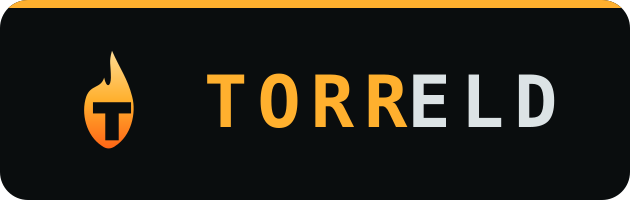

<p align="center">
  
</p>

[](https://github.com/mandakan/torreld/actions/workflows/deploy.yml)
[](https://torreld.urdr.dev/)
[](LICENSE)
[](LICENSE-CONTENT.md)
[](#how-it-works)
[](https://www.buymeacoffee.com/thias)

A dry-fire training-pack runner. Mobile-first, offline, no backend - a single
self-contained HTML file you prop up on a phone and shoot par-time reps against.

I built this for my own dry-fire training and put it online in case it helps
anyone else. It's the tool I actually use, shared as-is - no support promised,
no roadmap owed to anyone.

**Live: https://torreld.urdr.dev/**

## What it is

Range time is rare; dry fire is cheap. A well-structured, par-time-driven dry-fire
session builds the skills that live fire mostly just tests - grip, index,
presentation, movement. TORRELD renders a **pack**: a self-contained training
protocol (diagnosis, weekly plan, drills with par timers, evidence, sources).

The framework is content-agnostic - any "drills + evidence + references" curriculum
fits. Adding a program is dropping one JS file in `src/packs/`; no framework changes.
The current packs cover grip, reloads, stage planning and non-standard starts for
IPSC Production Optics, but nothing in the data model is specific to shooting.

## How it works

- **One self-contained artifact.** `build.py` inlines everything in `src/` into a
  single `dist/index.html` that opens from `file://` with no server, no CDN, no
  fetch. It works offline.
- **Vanilla JS, system fonts.** No framework, no bundler, no runtime dependencies.
  The only build tooling is Python file concatenation.
- **A shot timer in the page.** Par and circuit modes with Web Audio beeps, plus
  self-adjusting par times that adapt to how you actually shoot.

## Quick start

```sh
make build                                   # inline src/ -> dist/index.html
python3 -m unittest discover -s tests -t .   # build tests
open dist/index.html                         # or just double-click it
```

Optional screenshot check across viewports (needs Chromium once via
`npx playwright install chromium`):

```sh
node scripts/shot.mjs --all-packs            # phone + desktop shots of every pack
```

## Repository layout

```
src/framework/   shell.html, styles.css, timer.js, renderer.js, switcher.js, og-template.svg
src/packs/       one JS file per training program (calls registerPack)
scripts/         build/dev helpers (shot.mjs, verify-dist.sh, check-js.mjs, ...)
tests/           unit + integration tests for build.py
build.py         inlines src/ into dist/index.html (deterministic)
docs/            ARCHITECTURE, BUILD, CONTRIBUTING, DESIGN
```

Start with [CLAUDE.md](CLAUDE.md) for orientation and routing, then the focused doc
under [docs/](docs/) that fits your change.

## Contributing

PRs run build tests, verify the built artifact, and screenshot every pack (see
[docs/BUILD.md](docs/BUILD.md)). Merges to `main` auto-deploy to Cloudflare. See
[docs/CONTRIBUTING.md](docs/CONTRIBUTING.md).

## Support

TORRELD is free, open, and works offline. If it helps your training, you can chip
in for the packaging, hosting, and framework upkeep - not the drill content, which
builds on methods credited to the coaches and researchers in [CREDITS.md](CREDITS.md):

[](https://www.buymeacoffee.com/thias)

## License

Split by what it covers, both (c) 2026 Mathias Axell:

- **Code** (framework, build tooling, `scripts/`): [MIT](LICENSE).
- **Training-pack content** (the prose, drills, and curation in `src/packs/`):
  [CC BY-SA 4.0](LICENSE-CONTENT.md) - reuse and adapt with attribution, keep it
  share-alike.

The drills describe widely-practiced techniques that are not owned by this
project; those methods are credited to their originators, and the science is
cited, in [CREDITS.md](CREDITS.md). TORRELD reproduces no third-party text or
images - only its own expression and a citation.
